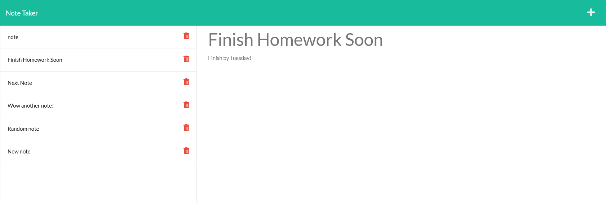

# Note Taker   

## Table of Contents  

* [Installation](#installation)
* [Description](#description)
* [URLs](#urls)
* [Usage](#usage)
* [Images](#images)
* [Credits](#credits)
* [License](#license)
* [Contributions](#contributions)
* [Tests](#tests)
* [Questions](#questions)

## Installation  

To install this on your own server, you will need express for testing on your localhost and uuid for random Id creations.  

## Description  

This application will allow you to save notes and click through them to bring them back up as needed. They are saved in a json file/database. This is great for anyone wanting to save notes on the go!  

## URLs  

GitHub repository: https://github.com/ajlineb/Note_Taker  

Webpage: https://note-taker-ajlineba.herokuapp.com/  

## Usage  

User will be able to save notes using a title and description, then when saved it will be docked to the left portion of the webpage. When clicked on the user will see the title and the note left back on the right side of the page. User can save as many notes as needed!  

## Images  

  

## Credits  

UNC Chapel Hill BootCamp for start code.  

## License  

MIT License  

## Contributions  

Send an email and let me know what should be added!  

## Tests  

Start up a localhost server and start typing in some notes!  

## Questions  

Contact by:  
GitHub Username: [ajlineb](https://github.com/ajlineb)  
Email: anthonylinebaugh95@gmail.com